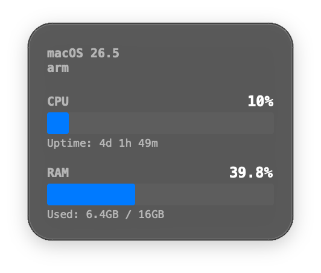

<div align="center">
    <pre>
    __                            __                      .___.__               .__                
    |  | __  _________.__. _______/  |_  ____   _____    __| _/|__| ____________ |  | _____  ___.__.
    |  |/ / /  ___<   |  |/  ___/\   __\/ __ \ /     \  / __ | |  |/  ___/\____ \|  | \__  \<   |  |
    |    <  \___ \ \___  |\___ \  |  | \  ___/|  Y Y  \/ /_/ | |  |\___ \ |  |_> >  |__/ __ \\___  |
    |__|_ \/____  >/ ____/____  > |__|  \___  >__|_|  /\____ | |__/____  >|   __/|____(____  / ____|
        \/     \/ \/         \/            \/      \/      \/         \/ |__|             \/\/     
    </pre>
</div>
<p align="center">
    the telemetry overlay for ktools.
</p>
<p align="center">
    
    
</p>

⠀

# what is this?

ksystemdisplay is the telemetry overlay for ktools. it provides live system stats directly on ur desktop. unlike system monitor apps that hog resources and stay in the dock, this one is a low-footprint, frameless window that lives above all spaces and ignores focus.



### features

* instant metrics: real-time CPU/RAM usage tracking via psutil.
* non-intrusive: frameless, click-through, and ignores cycle behaviors make it invisible to сmd+tab and mouse events.
* system-aware: reacts to macOS dark/light mode changes dynamically without a restart.
* power-efficient: only polls stats while the widget is visible.

⠀

# how to use

### 1. summoning the tool

just hit

```
⌥⌘\ (option + command + backslash)
```

global event monitors capture this shortcut anywhere in the OS.

### 2. interaction

* it slides in from the left and slides out on dismiss.
* it's completely transparent to input, so u don't have to worry about accidentally clicking it while working.

⠀

### final thoughts

is there anyone who read this?

by kriaiss.